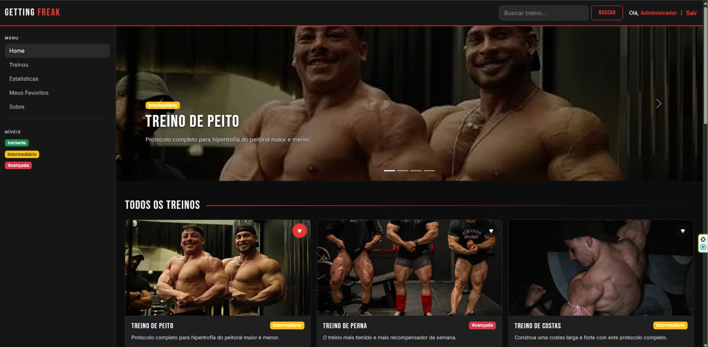
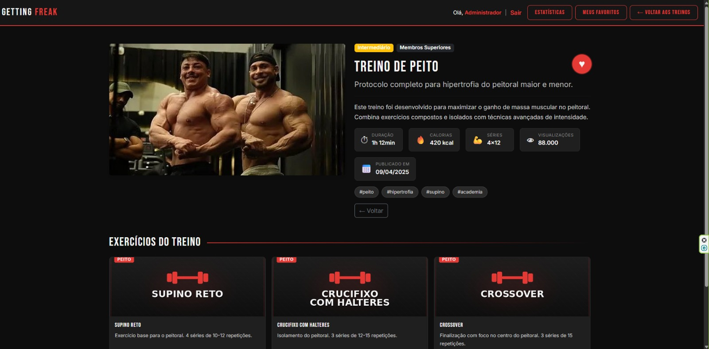
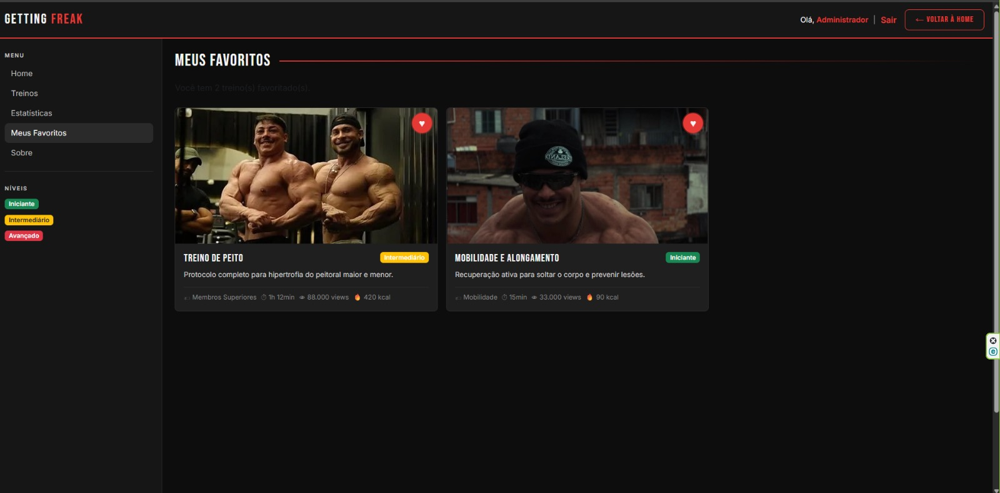

# Trabalho Prático - Semana 15

Login de usuário + funcionalidade de personalização (Favoritos) para o projeto **Getting Freak**.

## Informações do trabalho

- Nome: João Paulo Ferreira Rodrigues
- Matrícula: 908448
- Proposta de projeto escolhida: Getting Freak
- Breve descrição: O site é voltado para compartilhar treinos, dietas e dicas de saúde, além de contar com um blog pessoal para dividir experiências e atualizações do dia a dia.

## Prints obrigatórios

**Home mostrando o usuário logado**

**Funcionalidade de favoritar treinos**

**Página "Meus Favoritos"**

